## Task Management Project
In this project,
- In the user service, users are registered and logged in.
- In the project service, projects are recorded in the system. Afterwards, projects used more than once are cached to the Redis side when a Get request is made.
- In the task service, a new task is created using users and the project.-
- There are 4 microservices, when a task created via task-service that service insert a record onto task table(postgre) and it produce an event to task_service.task_created.0 topic.And when a task updated via task-service that service update a record onto task table(postgre) and it produce an event to task_service.task_updated.0 topic.
- Notification-consumer service listen task_service.task_created.0 and task_service.task_updated.0 topics and simulates the logic of sending notification after the event it consumes after notification is sending successfully service insert a record onto couchbase notification bucket.
## System Architechure
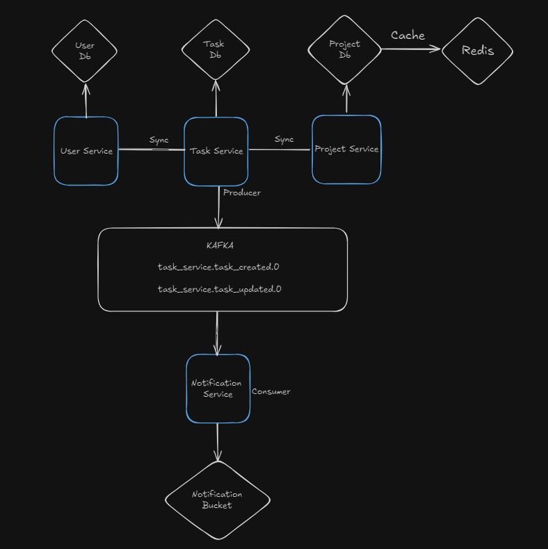

## Configuration Repository and Core Repository
- [Project Configuration Files Repository](https://github.com/feyzaozcini/task-management-config).
  
- [Core Project Repository](https://github.com/feyzaozcini/TurkcellCRMCore) and [Core Project Deployment On Maven Central](https://central.sonatype.com/artifact/io.github.haiykut/core).

## 💻 Technologies

- [Java 17](https://docs.oracle.com/en/java/javase/17/)
- [Spring Boot 3.2.5](https://docs.spring.io/spring-boot/docs/current/reference/html/getting-started.html)
- [Maven](https://maven.apache.org/guides/getting-started/)
- [Lombok](https://projectlombok.org/setup/)
- [MapStruct](https://mapstruct.org/)
- [SwaggerUI](https://swagger.io/tools/open-source/getting-started/)
- [PostgreSQL](https://www.postgresql.org/docs/)
- [Spring Security](https://spring.io/projects/spring-security)
- [Spring Cloud Netflix](https://cloud.spring.io/spring-cloud-netflix/reference/html/)
- [Spring Cloud FeignClient](https://docs.spring.io/spring-cloud-openfeign/docs/current/reference/html/)
- [Spring Cloud Config](https://docs.spring.io/spring-cloud-config/docs/current/reference/html/)
- [Apache Kafka](https://kafka.apache.org/intro)
- [Docker](https://www.docker.com/get-started/)
- [Couchbase](https://www.couchbase.com/)
- [Flyway](https://www.red-gate.com/products/flyway/community/)

## Setup
- Before run project you need to start docker desktop
- After docker is up, run the docker-compose.yml 
- After the run docker-compose.yml file you will see docker desktop like this: 
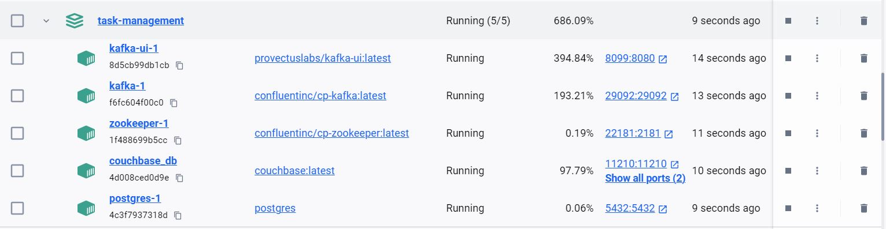

## DB Connection
# Postgre Connection:
    url: jdbc:postgresql://localhost:5432/userservice
    username: prostgres
    password: test

    url: jdbc:postgresql://localhost:5432/projectservice
    username: prostgres
    password: test

    url: jdbc:postgresql://localhost:5432/taskservice
    username: prostgres
    password: test

# Couchbase Connection & Settings
- #### Open http://localhost:8091/ on your browser

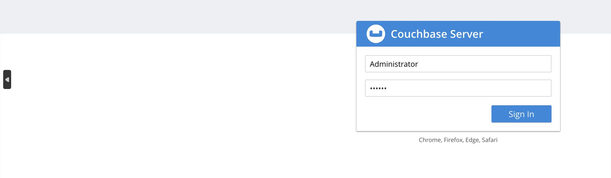

      username: Administrator
      password: 123456

- #### Open the buckets tab and click the **ADD BUCKET**
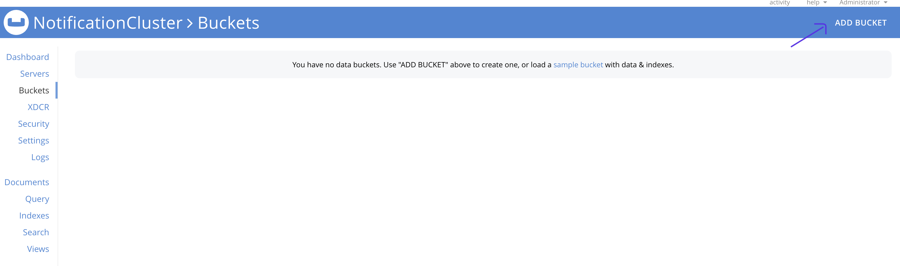

- #### write the bucket name in our example => bucket name is **"notification"**
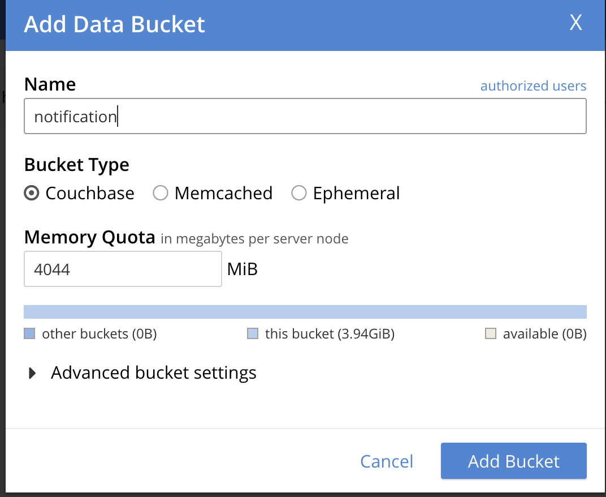

- #### After that open the query tab on the left side
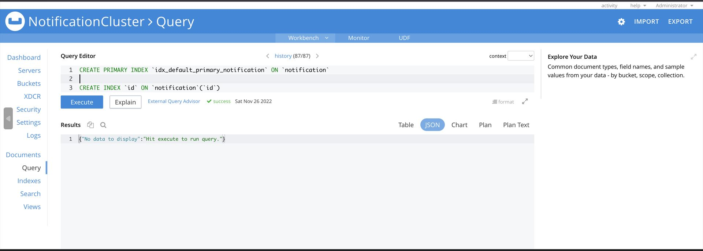
- #### Run 2 query separately to create index on bucket

      1) CREATE PRIMARY INDEX `idx_default_primary_notification` ON `notification`
      2) CREATE INDEX `id` ON `notification`(`id`)
- #### Open the Security tab on the left side and click the **ADD USER** 
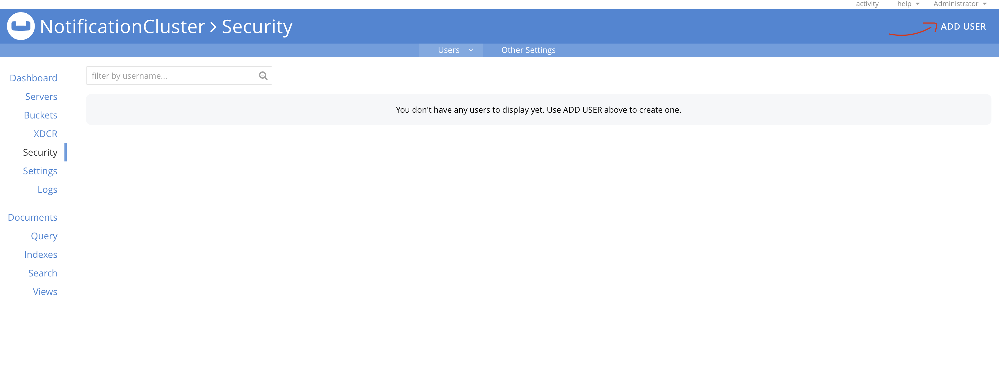
- #### After click the add user you will see a new popup and fill the informations like :
      Username: admin
      Full Name: admin
      Password: 123456
      Verify Password: 123456
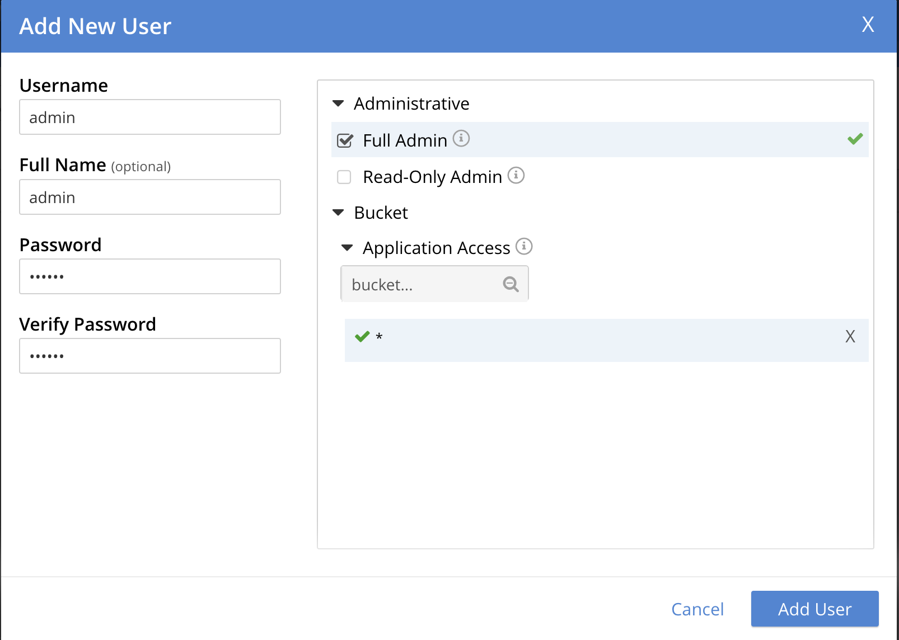

## User Service
Users register and log in to the system

Method	| Path	| Description	
------------- | ------------------------- | ------------- |
POST	| /auth/register	| Register for users	| 
POST	| /auth/login	| Login for users	|
GET	| /auth/{id}	| Get specific user information by id	| 
GET	| /auth/ids	| Get multiple user information	| 

## Project Service
Projects and information are recorded in the system

Method	| Path	| Description 
------------- | ------------------------- | ------------- |
GET	| /projects	| Get all the projects	
GET	| /projects/{id} |Get specific project by id	  
POST	| /projects	| Create new project	
POST	| /projects/search	|Searching for projects with specific features
PUT	| /projects	| Update project	
DELETE	| /projects/{id}	| Delete project by id	

### Project Cache Redis

- Caching multiple projects and then calling them from there is good for the performance of the project.

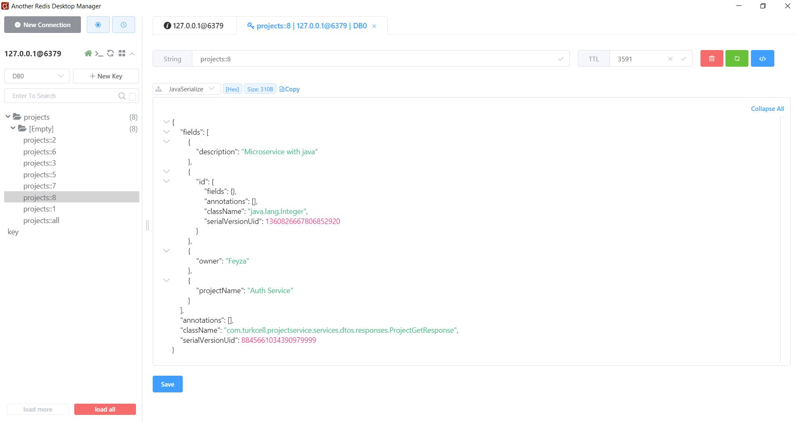

## Task Service
Task creation service using user and project service

Method	| Path	| Description	
------------- | ------------------------- | ------------- |
GET	| /tasks	| Get all the tasks
GET	| /tasks/{id}	| Get specific task by id	
POST	| /tasks	| Create new task
POST	| /tasks/search	| Searching for tasks with specific features
PUT	| /tasks	| Update task

## Notification Service
The Notification Service listens for task creation and update events using Kafka. It produces notifications for these events and records them in Couchbase.

### Kafka Topics:
taskservice.task_created.0: Published when a task is created.

taskservice.task_updated.0: Published when a task is updated.

- Kafka UI
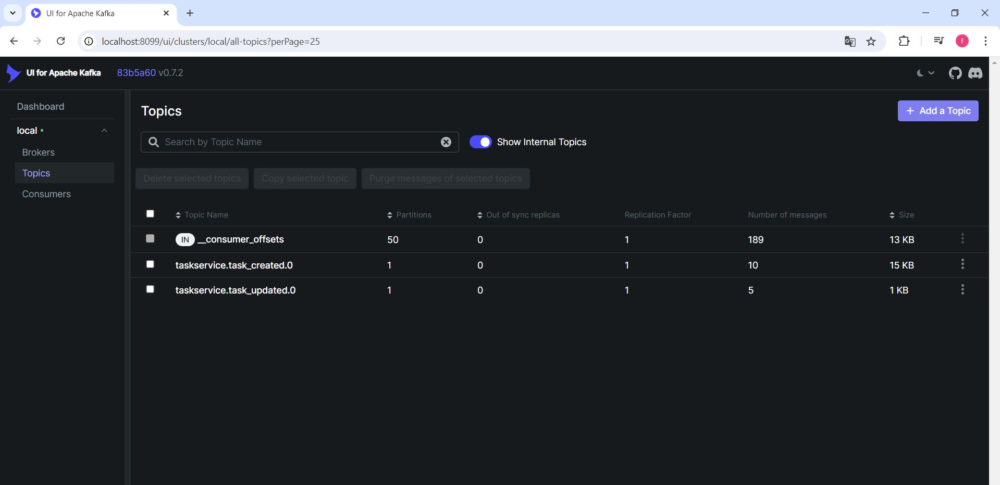

- Task Service Producer
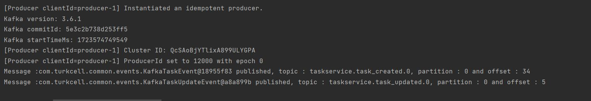

- Notification Consumer
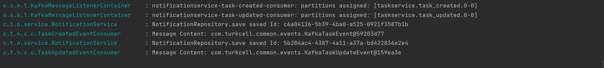

